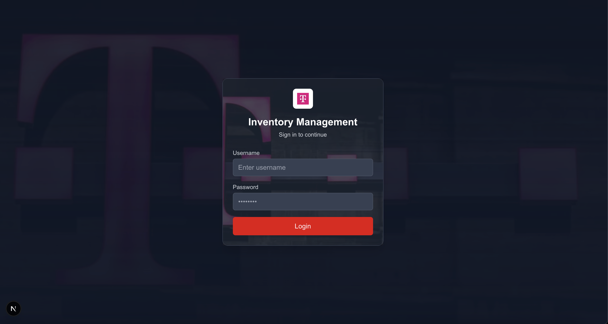
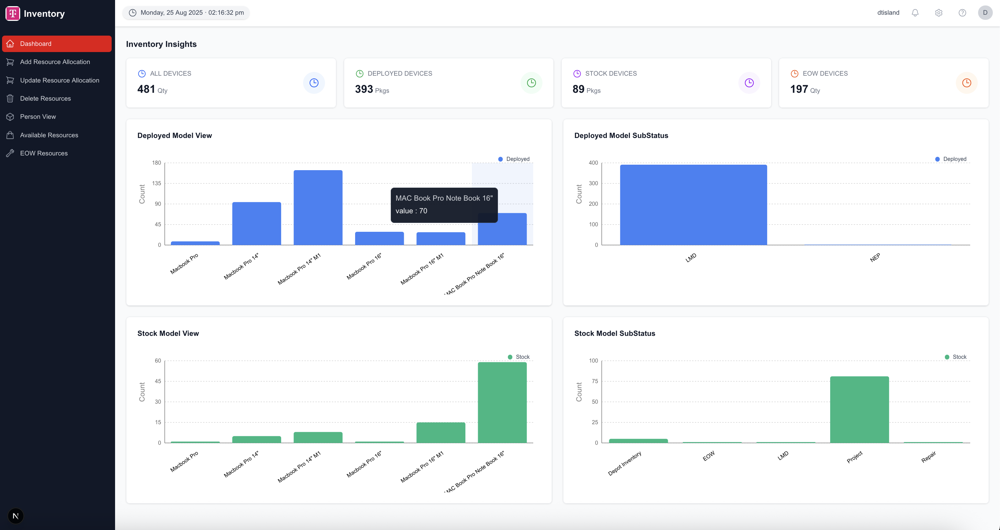
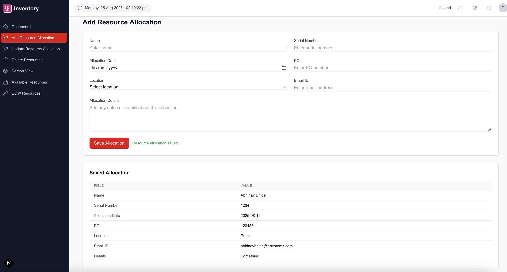
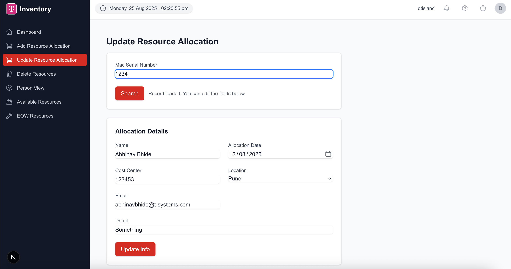
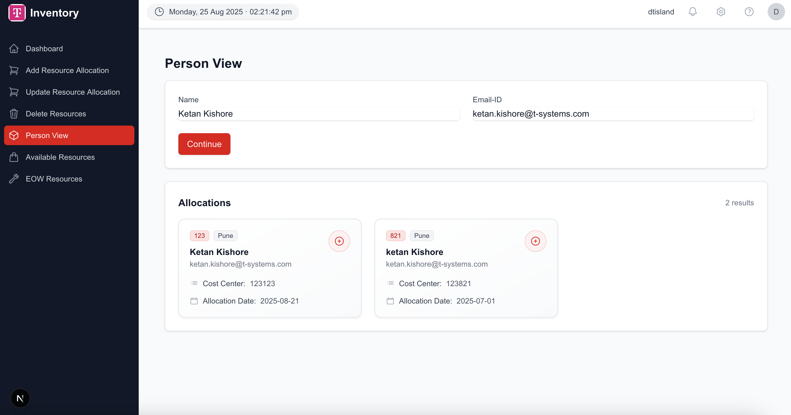
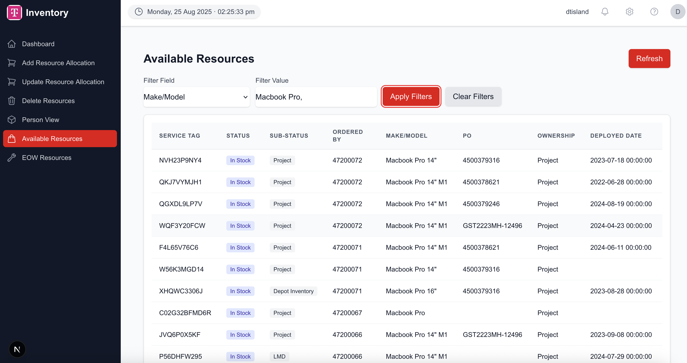
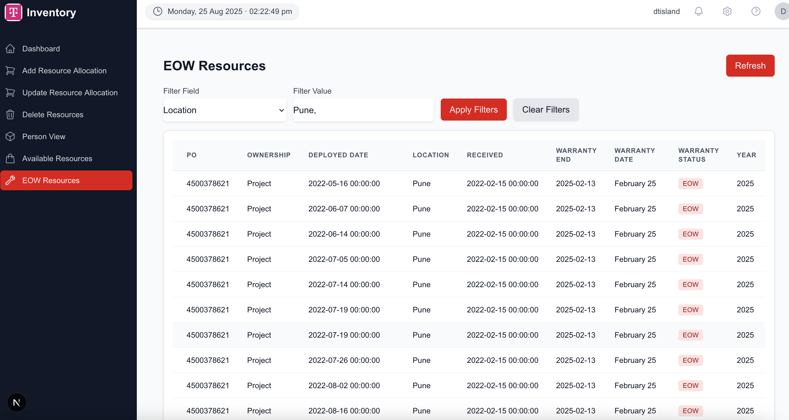
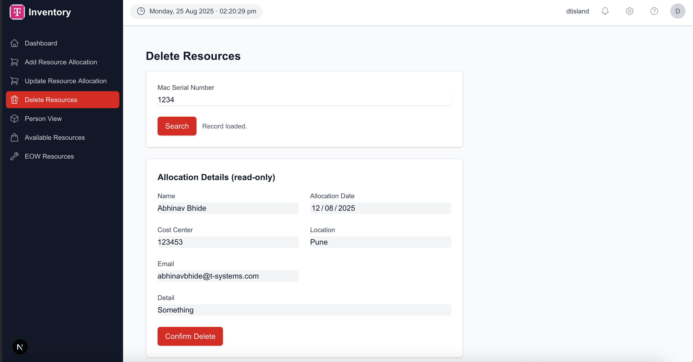

# Inventory Management Frontend (Next.js)

This repository contains the frontend for an Inventory Management system built with Next.js, React, TypeScript, and Tailwind CSS. It provides a dashboard and forms to add, view, and update resource allocations while integrating with a FastAPI backend.

## Contents
- Overview
- Tech stack and scripts
- Project structure
- Pages and user flows
- Validation rules
- Backend integration (API contracts)
- Getting started
- Configuration and environment
- Troubleshooting
- Future improvements

## Overview
The frontend provides:
- A dashboard with inventory insights and charts.
- A form to add new resource allocations with strict validation.
- A page to search and update existing resource allocations by serial number.
- A person-centric search view to find allocations by name and email.

All API calls assume a local FastAPI server at `http://127.0.0.1:8000`.

## Visual walkthrough
- **Login**
  
  

- **Dashboard**
  
  

- **Add Resource Allocation**
  
  

- **Update Resource Allocation**
  
  

- **Person View**
  
  

- **Available Resources**
  
  

- **EOW Resources**
  
  

- **Delete Resources**
  
  

### Authentication and session
- The root route `/` is a Login page.
- On successful login, we set cookies: `auth=1` and `user=<username>` and redirect to `/dashboard`.
- `middleware.ts` protects app routes and redirects unauthenticated users to `/`.
- `src/components/Header.tsx` reads the `user` cookie to display the exact username (no fallback), and provides an avatar dropdown with Logout which clears cookies and returns to `/`.

### Branding and assets
- The site logo uses `inventory-dashboard/public/dl-telekom-logo-01.jpg` everywhere (Sidebar, Login, and favicon).
- Favicon is provided via `src/app/favicon.ico` or `src/app/icon.png`. Additionally, `src/app/layout.tsx` links `<link rel="icon" href="/dl-telekom-logo-01.jpg" />`.
- Login page background uses `inventory-dashboard/public/login_page.jpg` with a subtle dark overlay for readability.

## Tech stack and scripts
- Next.js: `15.4.6`
- React: `19.1.0`
- TypeScript: `^5`
- Tailwind CSS: `^4`
- Icons: `@heroicons/react`, `lucide-react`
- Charts: `recharts`

Scripts (in [inventory-dashboard/package.json](./inventory-dashboard/package.json:0:0-0:0)):
- `npm run dev` — Start Next.js dev server with Turbopack
- `npm run build` — Production build
- `npm run start` — Start production server
- `npm run lint` — Run ESLint

## Project structure
Frontend root: `inventory-dashboard/`

Key paths:
- [src/app/page.tsx](./inventory-dashboard/src/app/page.tsx:0:0-0:0) — Root route (`/`), renders the Login page.
- [src/app/dashboard/page.tsx](./inventory-dashboard/src/app/dashboard/page.tsx:0:0-0:0) — `/dashboard` (main dashboard).
- [src/app/add-resource-allocation/page.tsx](./inventory-dashboard/src/app/add-resource-allocation/page.tsx:0:0-0:0) — `/add-resource-allocation` page.
- [src/app/update-resource-allocation/page.tsx](./inventory-dashboard/src/app/update-resource-allocation/page.tsx:0:0-0:0) — `/update-resource-allocation` page.
- [src/app/person-view/page.tsx](./inventory-dashboard/src/app/person-view/page.tsx:0:0-0:0) — `/person-view` page.
- [src/app/delete-resources/page.tsx](./inventory-dashboard/src/app/delete-resources/page.tsx:0:0-0:0) — `/delete-resources` page.
- [src/app/available-resources/page.tsx](./inventory-dashboard/src/app/available-resources/page.tsx:0:0-0:0) — `/available-resources` page.
- [src/app/eow-resources/page.tsx](./inventory-dashboard/src/app/eow-resources/page.tsx:0:0-0:0) — `/eow-resources` page.
- [src/app/api/dashboard/route.ts](./inventory-dashboard/src/app/api/dashboard/route.ts:0:0-0:0) — Mock API route for dashboard charts.
- [src/components/DashboardContent.tsx](./inventory-dashboard/src/components/DashboardContent.tsx:0:0-0:0) — Dashboard composition component.
- [src/app/layout.tsx](./inventory-dashboard/src/app/layout.tsx:0:0-0:0), [src/app/globals.css](./inventory-dashboard/src/app/globals.css:0:0-0:0) — App layout and global styles.

Directory layout (simplified):

inventory-dashboard/ src/ app/ add-resource-allocation/ page.tsx update-resource-allocation/ page.tsx person-view/ page.tsx api/ dashboard/ route.ts layout.tsx page.tsx globals.css components/ DashboardContent.tsx


Dashboard widgets used by [DashboardContent.tsx](./inventory-dashboard/src/components/DashboardContent.tsx:0:0-0:0):
- `InventoryInsights`
- `DeployedModelView`
- `StockModelView`
- `DeployedModelSubStatus`
- `StockModelSubStatus`

These consume mock data from [src/app/api/dashboard/route.ts](./inventory-dashboard/src/app/api/dashboard/route.ts:0:0-0:0) and render with `recharts`.

## Pages and user flows

### Login (`/`)
- File: [src/app/page.tsx](./inventory-dashboard/src/app/page.tsx:0:0-0:0)
- Theme aligned with the sidebar (dark palette with red accents).
- Uses Next.js `Image` for brand logo `/dl-telekom-logo-01.jpg` and a background `/login_page.jpg` with gradient overlay.
- On success: sets `auth=1` and `user=<username>` cookies and redirects to `/dashboard`.

### 1) Dashboard (`/dashboard`)
- Renders [DashboardContent](cci:1://file:///Users/A118390615/Library/CloudStorage/OneDrive-DeutscheTelekomAG/Projects/COE_Projects/inventory_management/inventory-dashboard/src/components/DashboardContent.tsx:8:0-44:1), aggregating charts and insights.
- Uses mocked dashboard data for local development.

### 2) Add Resource Allocation (`/add-resource-allocation`)
File: [src/app/add-resource-allocation/page.tsx](./inventory-dashboard/src/app/add-resource-allocation/page.tsx:0:0-0:0)
- Purpose: Create a new resource allocation record.
- Fields: `name`, `serialNumber`, `allocationDate` (date picker), `po`, `location` (dropdown), `email`, `details`.
- Behavior:
  - Validates all fields (see Validation rules).
  - On success: calls `POST /addResourceAllocation`, displays success alert, resets form, and shows a saved summary table.
  - On failure: shows field errors when provided and an “Unsuccessful operation” alert.

### 3) Update Resource Allocation (`/update-resource-allocation`)
File: [src/app/update-resource-allocation/page.tsx](./inventory-dashboard/src/app/update-resource-allocation/page.tsx:0:0-0:0)
- Purpose: Search by Mac serial number, load existing allocation, edit, and update.
- Flow:
  1. Enter Mac Serial Number → “Search”.
  2. If found, edit fields: `name`, `allocation_date` (date picker), `cost_center`, `location` (Pune/Bangalore), `email`, `detail`.
  3. Click “Update Info” to persist changes.
- UX highlights:
  - Allocation Date uses an HTML date input and normalizes to `YYYY-MM-DD`.
  - Location is sanitized to only Pune/Bangalore; non-matching values are cleared.
  - Email accepts any valid format; empty is allowed. Invalid non-empty blocks update.
  - Buttons have loading/disabled states during network calls or invalid states.
- Backend:
  - `POST /getSerialnumberAllocation` — fetch record by serial number.
  - `POST /updateResourceAllocation` — update record.

### 4) Person View (`/person-view`)
File: [src/app/person-view/page.tsx](./inventory-dashboard/src/app/person-view/page.tsx:0:0-0:0)
- Purpose: Search allocations by `name` and `email`.
- Email requires `@t-systems.com` domain.
- Results appear as responsive cards; details open in a modal.
- Backend: `POST /getResourceAllocation`.

### 5) Available Resources (`/available-resources`)
File: [src/app/available-resources/page.tsx](./inventory-dashboard/src/app/available-resources/page.tsx:0:0-0:0)
- Purpose: View all stock devices with rich client-side filtering.
- Filters:
  - Field selector (Service Tag, Status, Sub-Status, Ordered By, Make/Model, PO, Ownership, Deployed Date, Location, Received, Warranty End/Date/Status, Year)
  - Multi-value input: accepts comma/semicolon/newline separated tokens.
  - Dropdown suggestions: shows recommended values based on selected field; click to insert; auto appends ", ".
- Apply/Clear Filters buttons control filtering.
- UI note: No red token chips are shown under the input (aligned with `/eow-resources`).
- Backend: `POST /getStockDevicesDetailed`.

### 6) EOW Resources (`/eow-resources`)
File: [src/app/eow-resources/page.tsx](./inventory-dashboard/src/app/eow-resources/page.tsx:0:0-0:0)
- Purpose: View devices with End-of-Warranty (EOW) status.
- Same filter UX and behavior as Available Resources.
- Backend: `POST /showEowResources`.

### 7) Delete Resources (`/delete-resources`)
File: [src/app/delete-resources/page.tsx](./inventory-dashboard/src/app/delete-resources/page.tsx:0:0-0:0)
- Purpose: Look up a record by Mac Serial Number and delete it.
- Flow: Search by serial → show read-only details → Confirm Delete.
- Backend: `POST /getSerialnumberAllocation`, `POST /deleteResources`.

## Validation rules

- Add Resource Allocation:
  - All fields are required.
  - Email must end with `@t-systems.com`.
  - Location must be one of: `Pune`, `Bangalore`.
  - Allocation Date required, via date picker.

- Update Resource Allocation:
  - Search requires serial number.
  - Email: any valid format; can be empty. Invalid non-empty blocks update.
  - Location limited to `Pune`/`Bangalore`.
  - Allocation Date normalized to `YYYY-MM-DD`.

- Person View:
  - Name and email are required.
  - Email must be `@t-systems.com`.

## Backend integration (API contracts)
Base URL: `http://127.0.0.1:8000`

Endpoints used:

- `POST /addResourceAllocation`
  - Request body:
    ```json
    {
      "name": "Alice",
      "serialNumber": "XYZ123",
      "allocationDate": "2025-08-15",
      "po": "PO-0001",
      "location": "Pune",
      "email": "alice@t-systems.com",
      "detail": "MacBook Pro 14"
    }
    ```
  - Response: `{ "status": "Success" }` on success; may include `errors` for fields.

- `POST /getSerialnumberAllocation`
  - Request:
    ```json
    { "serialnumber": "XYZ123" }
    ```
  - Response: An object/array with `name`, `allocation_date`, `cost_center`, `location`, `email`, `detail` (or `details`).

- `POST /updateResourceAllocation`
  - Request:
    ```json
    {
      "serialnumber": "XYZ123",
      "name": "Alice",
      "allocation_date": "2025-08-16",
      "cost_center": "CC-01",
      "location": "Bangalore",
      "email": "alice@example.com",
      "detail": "Reassigned"
    }
    ```
  - Response: `{ "status": "Success" }` on success.

- `POST /getResourceAllocation`
  - Request:
    ```json
    { "name": "Alice", "email": "alice@t-systems.com" }
    ```
  - Response: Array with `service_tag_number`, `name`, `allocation_date`, `cost_center`, `location`, `email`.

- `POST /getStockDevicesDetailed`
  - Request: none
  - Response: Array of stock devices with fields:
    `service_tag_number`, `status`, `sub_status`, `ordered_by`, `make_model`, `po`, `ownership`,
    `deployed_date`, `location`, `received`, `warranty_end`, `warranty_date`, `warranty_status`, `year`.

- `POST /showEowResources`
  - Request: none
  - Response: Array of inventory records (same shape as stock devices) filtered to EOW items.

- `POST /deleteResources`
  - Request:
    ```json
    { "serialnumber": "XYZ123" }
    ```
  - Response: `{ "status": "Success" }` on success.

## Backend operations (complete FastAPI endpoints)

These endpoints are implemented in `action_server/server_file.py` and backed by SQL in `action_server/utility_file.py`.

- **Health**
  - `POST /test` → `{ "status": "app working as expected" }`

- **Inventory counts and summaries**
  - `POST /getAllDevices` → `{ "count": number }`
  - `POST /getDeployedDevices` → `{ "count": number }`
  - `POST /getStockDevices` → `{ "count": number }`
  - `POST /getEowDevices` → `{ "count": number }`
  - `POST /getDeployedModelView` → `{ [make_model: string]: number }`
  - `POST /getStockModelView` → `{ [make_model: string]: number }`
  - `POST /getDeployedModelSubStatus` → `{ [sub_status: string]: number }`
  - `POST /getStockModelSubStatus` → `{ [sub_status: string]: number }`

- **Detailed datasets**
  - `POST /getStockDevicesDetailed` → Array of stock device records.
  - `POST /showEowResources` → Array of EOW device records (same shape as stock with EOW filter).

- **Resource allocation CRUD**
  - `POST /addResourceAllocation` → `{ "status": "Success" | "Failed" }`
    - Body fields (from UI): `name`, `serialNumber`, `allocationDate`, `po`, `location`, `email`, `detail`.
    - Note: Backend uses `details/detail` column naming in different places; UI sends `detail`.
  - `POST /getSerialnumberAllocation` → Object with allocation fields for a serial number.
  - `POST /getResourceAllocation` → Array of allocations filtered by `name` and `email`.
  - `POST /updateResourceAllocation` → `{ "status": "Success" }` with body: `serialnumber`, `name`, `allocation_date`, `cost_center`, `location`, `email`, `detail`.
  - `POST /deleteResources` → `{ "status": "Success" }` with body: `serialnumber`.

- **Authentication**
  - `POST /getUserAuthorization` → `{ "status": "Success" | "Failed" }`
    - Body: `{ "username": string, "password": string }`
    - Used by `src/app/page.tsx` to set `auth` and `user` cookies on success.

## Getting started

1. Install dependencies (from `inventory-dashboard/`):
```bash
npm install
```
2. Run the frontend:
```bash
npm run dev
```
Open http://localhost:3000

3. Run the backend (from `action_server/`):
   - Python: see `.python-version` (3.13). Install dependencies:
```bash
pip install -r <(python - <<'PY'\nimport tomllib,sys;print('\n'.join(tomllib.load(open('pyproject.toml','rb'))['project']['dependencies']))\nPY
)
```
   - Or use `uv` (recommended):
```bash
uv sync
```
   - Configure environment in `action_server/.env`:
```env
username=YOUR_DB_USER
password=YOUR_DB_PASSWORD
database_url=YOUR_DB_HOST
port=5432
database=inventory
```
   - Start FastAPI with Uvicorn:
```bash
uvicorn server_file:app --host 127.0.0.1 --port 8000 --reload
```
   - CORS is enabled in `server_file.py` for all origins by default.

4. Production build:
```bash
npm run build
npm run start
```

## Configuration and environment

* API base URL is hardcoded in:
  - src/app/add-resource-allocation/page.tsx
  - src/app/update-resource-allocation/page.tsx
  - src/app/person-view/page.tsx
  - src/app/delete-resources/page.tsx
  - src/app/available-resources/page.tsx
  - src/app/eow-resources/page.tsx
* Recommended improvement: Use `NEXT_PUBLIC_API_BASE_URL` and centralize fetch logic.
* Tailwind CSS v4 configured via `@tailwindcss/postcss`.
* Global styles: `src/app/globals.css`

## Troubleshooting
- CORS errors: Allow `http://localhost:3000` in the FastAPI CORS settings.
- Network errors/404: Confirm backend endpoints and that FastAPI is running at `127.0.0.1:8000`.
- Date format issues: Update page normalizes to `YYYY-MM-DD`. If backend differs, adjust normalization.
- Email validation discrepancies: Add/Person View require `@t-systems.com`; Update page allows any valid email or empty.